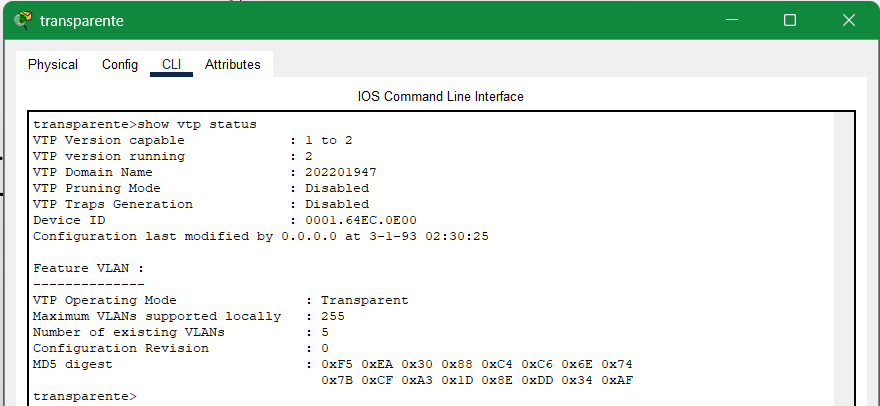

# Redes de Computadoras N
## Hoja de Trabajo 1
### Primer Semestre 2025
```js
Universidad San Carlos de Guatemala
Programador: Pablo Andres Rodriguez Lima
Carne: 202201947
Correo: pabloa10rodriguez@gmail.com
```
---

# Comandos utilizados para la configuración en los switches

## Cambio de Nombre de SWITCH
```bash
enable
configure t
hostname servidor
exit
write memory
```

## Verificacion del Estado de VTP y VLANs
```bash
show vtp status
show vlan brief
```

---

## Configuracion de SWITCH SERVIDOR
```bash
Switch# conf t
Switch(config)# vtp version 2
Switch(config)# vtp domain 202201947
Switch(config)# vtp password 202201947
Switch(config)# vtp mode server

Switch(config)# vlan 17
Switch(config-vlan)# name ADMON
Switch(config-vlan)# vlan 27
Switch(config-vlan)# name MERCA
Switch(config-vlan)# vlan 37
Switch(config-vlan)# name VENTAS
Switch(config-vlan)# exit
```

## Configuracion de SWITCH TRANSPARENTE
```bash
Switch# conf t
Switch(config)# vtp version 2
Switch(config)# vtp domain 202201947
Switch(config)# vtp password 202201947
Switch(config)# vtp mode transparent
Switch(config)# exit
```

## Configuracion de SWITCH CLIENTES
```bash
Switch# conf t
Switch(config)# vtp version 2
Switch(config)# vtp domain 202201947
Switch(config)# vtp password 202201947
Switch(config)# vtp mode client
Switch(config)# exit
```

---

## Configuracion de Modo TRUNK
### Conexion entre SERVIDOR y TRANSPARENTE
```bash
Switch# conf t
Switch(config)# interface f0/1
Switch(config-if)# switchport mode trunk
Switch(config-if)# switchport trunk allowed vlan 17,27,37
Switch(config-if)# exit
```

### Conexion entre TRANSPARENTE y SERVIDOR, CLIENTE 01, CLIENTE 02
```bash
Switch# conf t
Switch(config)# interface range f0/1 - 3
Switch(config-if)# switchport mode trunk
Switch(config-if)# switchport trunk allowed vlan 17,27,37
Switch(config-if)# exit
```

### Conexion entre CLIENTE 01 y TRANSPARENTE, CLIENTE 02
```bash
Switch# conf t
Switch(config)# interface range f0/1 - 2
Switch(config-if)# switchport mode trunk
Switch(config-if)# switchport trunk allowed vlan 17,27,37
Switch(config-if)# exit
```

### Conexion entre CLIENTE 02 y TRANSPARENTE, CLIENTE 01
```bash
Switch# conf t
Switch(config)# interface f0/1
Switch(config-if)# switchport mode trunk
Switch(config-if)# switchport trunk allowed vlan 17,27,37
Switch(config-if)# exit
Switch(config)# interface f0/3
Switch(config-if)# switchport mode trunk
Switch(config-if)# switchport trunk allowed vlan 17,27,37
Switch(config-if)# exit
```

---

## Configuracion de Modo ACCESS
### Conexion entre CLIENTE 01 y PC0, PC1, PC2
```bash
Switch# conf t
Switch(config)# interface f0/10
Switch(config-if)# switchport mode access
Switch(config-if)# switchport access vlan 17
Switch(config-if)# exit
Switch(config)# interface f0/11
Switch(config-if)# switchport mode access
Switch(config-if)# switchport access vlan 27
Switch(config-if)# exit
Switch(config)# interface f0/12
Switch(config-if)# switchport mode access
Switch(config-if)# switchport access vlan 37
Switch(config-if)# exit
```

### Conexion entre CLIENTE 02 y PC0, PC1, PC2
```bash
Switch# conf t
Switch(config)# interface f0/10
Switch(config-if)# switchport mode access
Switch(config-if)# switchport access vlan 17
Switch(config-if)# exit
Switch(config)# interface f0/11
Switch(config-if)# switchport mode access
Switch(config-if)# switchport access vlan 27
Switch(config-if)# exit
Switch(config)# interface f0/12
Switch(config-if)# switchport mode access
Switch(config-if)# switchport access vlan 37
Switch(config-if)# exit
```

---

# Capturas de Protocolos VTP
## VTP SERVER


## VTP TRANSPARENT


## VTP CLIENT01


## VTP CLIENT02


---

# Capturas VLAN
## VLAN SERVER


## VLAN TRANSPARENT


## VLAN CLIENT01


## VLAN CLIENT02


---

# Capturas ping entre Pc de misma VLAN

## ADMON - MERCA Y ADMON - ADMON


## MERCA - VENTAS Y MERCA - MERCA


## VENTAS - MERCA Y VENTAS - VENTAS


---

