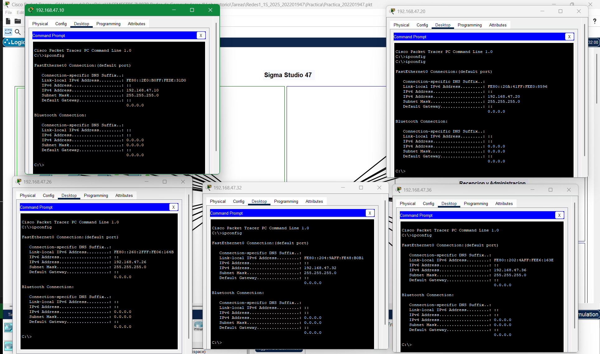
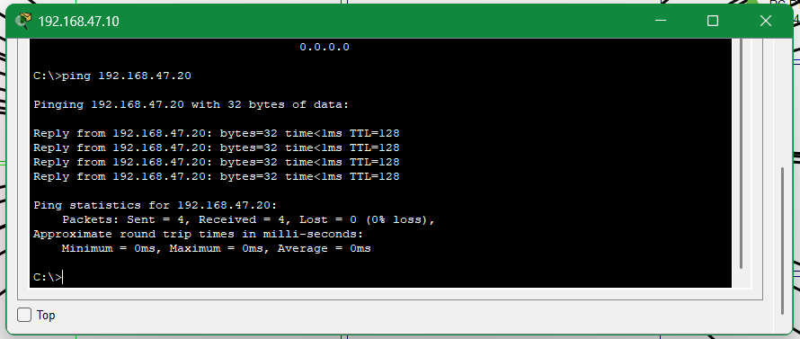
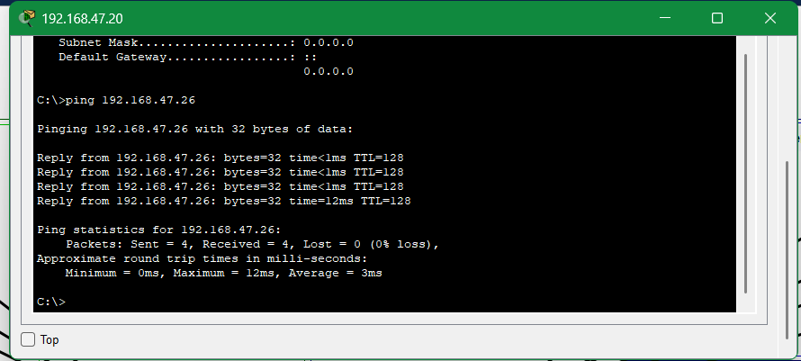
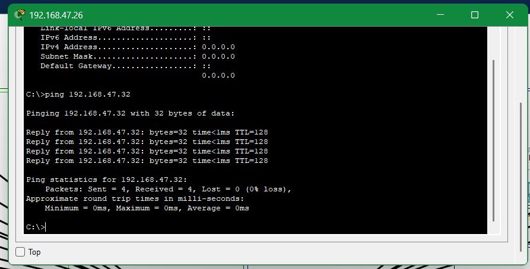
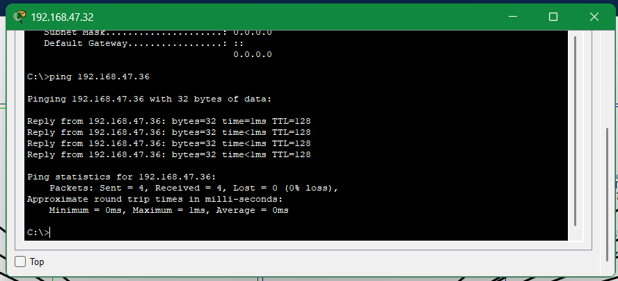
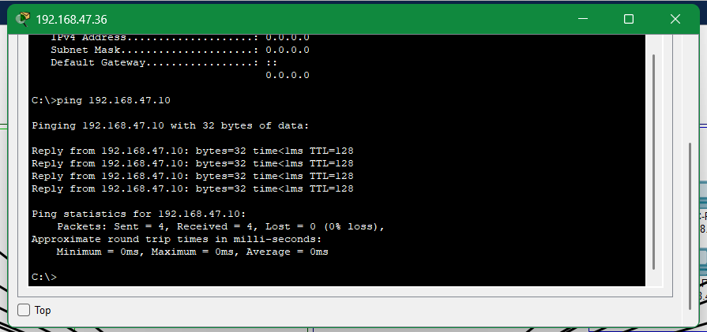
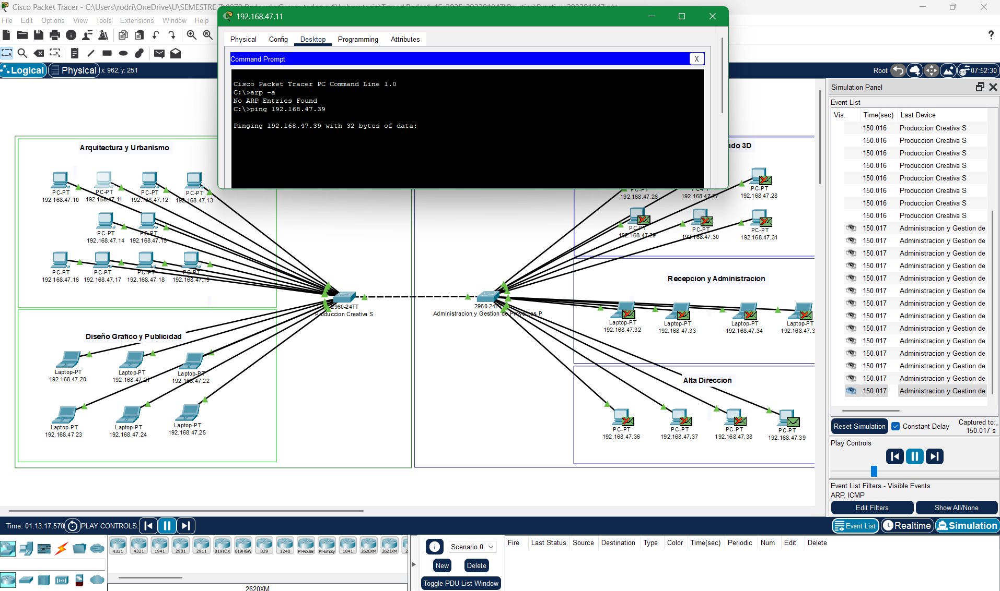
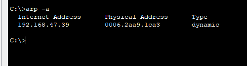
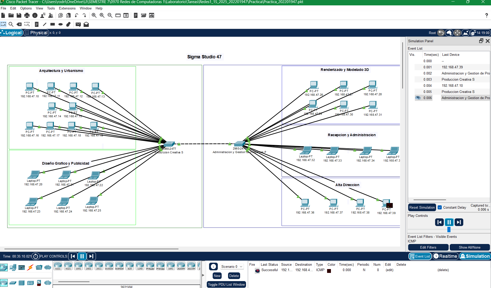

# Redes de Computadoras N
## Practica
### Primer Semestre 2025
```js
Universidad San Carlos de Guatemala
Programador: Pablo Andres Rodriguez Lima
Carne: 202201947
Correo: pabloa10rodriguez@gmail.com
```
---

### 1. Detalle de configuracion de dispositivos

|No  | Área                      | Dispositivo | IP            | Switch | Puerto Ethernet |
|----|---------------------------|------------|--------------|--------|----------------|
| 01 | Arquitectura y Urbanismo  | Pc         | 192.168.47.10 | 1      | 10             |
| 02 | Arquitectura y Urbanismo  | Pc         | 192.168.47.11 | 1      | 11             |
| 03 | Arquitectura y Urbanismo  | Pc         | 192.168.47.12 | 1      | 12             |
| 04 | Arquitectura y Urbanismo  | Pc         | 192.168.47.13 | 1      | 13             |
| 05 | Arquitectura y Urbanismo  | Pc         | 192.168.47.14 | 1      | 14             |
| 06 | Arquitectura y Urbanismo  | Pc         | 192.168.47.15 | 1      | 15             |
| 07 | Arquitectura y Urbanismo  | Pc         | 192.168.47.16 | 1      | 16             |
| 08 | Arquitectura y Urbanismo  | Pc         | 192.168.47.17 | 1      | 17             |
| 09 | Arquitectura y Urbanismo  | Pc         | 192.168.47.18 | 1      | 18             |
| 10 | Arquitectura y Urbanismo  | Pc         | 192.168.47.19 | 1      | 19             |
| 11 | Diseño Grafico y Publicidad  | Laptop  | 192.168.47.20 | 1      | 04             |
| 12 | Diseño Grafico y Publicidad  | Laptop  | 192.168.47.21 | 1      | 05             |
| 13 | Diseño Grafico y Publicidad  | Laptop  | 192.168.47.22 | 1      | 06             |
| 14 | Diseño Grafico y Publicidad  | Laptop  | 192.168.47.23 | 1      | 07             |
| 15 | Diseño Grafico y Publicidad  | Laptop  | 192.168.47.24 | 1      | 08             |
| 16 | Diseño Grafico y Publicidad  | Laptop  | 192.168.47.25 | 1      | 09             |
| 17 | Renderizado y Modelado 3D  | Pc        | 192.168.47.26 | 2      | 10             |
| 18 | Renderizado y Modelado 3D  | Pc        | 192.168.47.27 | 2      | 11             |
| 19 | Renderizado y Modelado 3D  | Pc        | 192.168.47.28 | 2      | 12             |
| 20 | Renderizado y Modelado 3D  | Pc        | 192.168.47.29 | 2      | 13             |
| 21 | Renderizado y Modelado 3D  | Pc        | 192.168.47.30 | 2      | 14             |
| 22 | Renderizado y Modelado 3D  | Pc        | 192.168.47.31 | 2      | 15             |
| 23 | Recepcion y Administracion  | Laptop   | 192.168.47.32 | 2      | 16             |
| 24 | Recepcion y Administracion  | Laptop   | 192.168.47.33 | 2      | 17             |
| 25 | Recepcion y Administracion  | Laptop   | 192.168.47.34 | 2      | 18             |
| 26 | Recepcion y Administracion  | Laptop   | 192.168.47.35 | 2      | 19             |
| 27 | Alta Direccion  | Pc                   | 192.168.47.36 | 2      | 20             |
| 28 | Alta Direccion  | Pc                   | 192.168.47.37 | 2      | 21             |
| 29 | Alta Direccion  | Pc                   | 192.168.47.38 | 2      | 22             |
| 30 | Alta Direccion  | Pc                   | 192.168.47.39 | 2      | 23             |  

---
### 2. Comandos Utilizados

#### Contraseñas
// Configuracion Contraseña de Switch1

```cmd
enable
configure terminal
enable secret *********
exit
write memory
```
// Configuracion Contraseña de Switch2

```cmd
enable
configure terminal
enable password *********
exit
write memory
```  
#### Nombres de Dispositivos
// Configuracion de nombre de Switch1

```cmd
enable
configure terminal
hostname prod
exit
write memory
```
// Configuracion de nombre de Switch2

```cmd
enable
configure terminal
hostname admon
exit
write memory
```
#### Verificar configuracion de VPC's
// Verificar configuracion de VPC's

```cmd
ipconfig
```


### 3. Configuracion de las VPC's

    - ip 192.168.47.10 area Arquitectura y Urbanismo
    - ip 192.168.47.20 area Diseño Grafico y Publicidad
    - ip 192.168.47.26 area Renderizado y Modelado 3D
    - ip 192.168.47.32 area Recepcion y Administracion
    - ip 192.168.47.36 area Alta Direccion


### 4. Ping entre Host

    - Desde Arquitectura y Urbanismo (192.168.47.10) → a Diseño Gráfico y Publicidad (192.168.47.20)



    - Desde Diseño Gráfico y Publicidad (192.168.47.20) → a Renderizado y Modelado 3D (192.168.47.26)



    - Desde Renderizado y Modelado 3D (192.168.47.26) → a Recepción y Administración (192.168.47.32)



    - Desde Recepción y Administración (192.168.47.32) → a Alta Dirección (192.168.47.36)



    - Desde Alta Dirección (192.168.47.36) → a Arquitectura y Urbanismo (192.168.47.10)



#### 5. Demostracion de envio de paquetes en modo simulacion

##### Envio de paquete ARP
- Desde Arquitectura y Urbanismo (192.167.47.11) a Alta Dirección (192.168.47.39)
  
- Tabla ARP actualizada  



##### Envio de paquete ICMP
- Desde Alta Dirección (192.168.47.39) a Arquitectura y Urbanismo (192.168.47.10)


